  

# Kareem Brathwaite-Henry

**Business development, product thinking, and the drive to build.**

My background is in business development, SaaS, and technology. Newtype is where those experiences meet product building, AI, and software. I’m interested in the point where commercial problems and emerging technology meet—and in turning that curiosity into useful tools.

I build things to understand what’s possible.

## 01 · Selected systems

### [GT Paddock](https://github.com/newtype1992/gt-paddock)
**Performance systems**

A local-first Gran Turismo 7 companion for recording telemetry, reviewing driving sessions, and comparing laps. Built around the loop from driving to analysis to improvement.

### [Rally](https://github.com/newtype1992/rally)
**Habit systems**

A personal habit tracker built with Expo and React Native. Daily check-ins, weekly progress, and completion history make consistency visible.

### [Prompt Dock](https://github.com/newtype1992/prompt-dock)
**AI workflow systems**

A browser extension for saving, organizing, and reusing AI prompts in the tools people already use. Built around a searchable prompt library and faster insertion into AI conversations.

### [Side Quest](https://github.com/newtype1992/side-quest)
**Game systems**

A top-down action roguelite in development with GameMaker. The current combat prototype stars Hype Man, with controller support, dodge rolls, and a bullet-clearing **Make Some Noise** ability. Original pixel art and editable Aseprite animation sources are included.

  

[Explore the game and source →](https://github.com/newtype1992/side-quest)

## 02 · Operating areas

**Sales · SaaS · AI · Product · Software · Automation**

Understanding the problem. Shaping the product. Building the system. Learning from how it works.

## 03 · The Newtype idea

**Curiosity → experimentation → creation.**

To me, Newtype represents adaptation: learning new systems, understanding how things work, and developing the ability to turn an idea into something real.

Every project is a way to solve a problem, test an idea, and expand what I’m capable of creating.

**Build → learn → iterate.**
